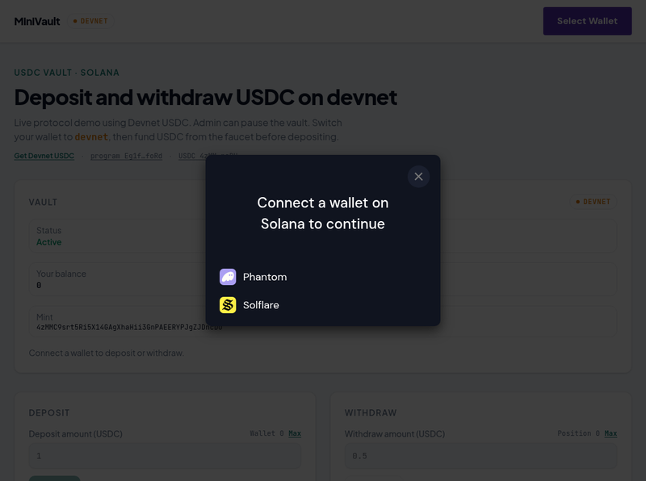
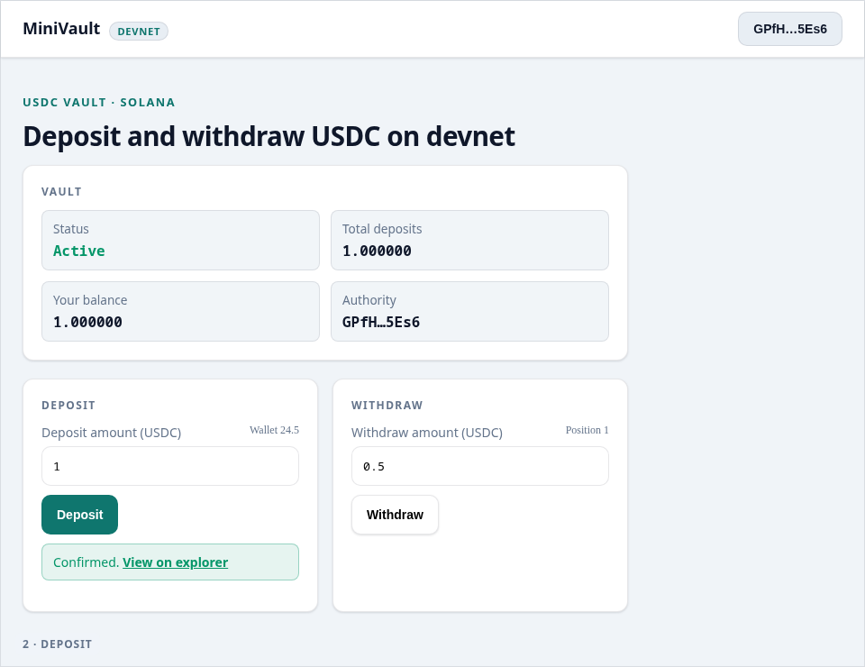
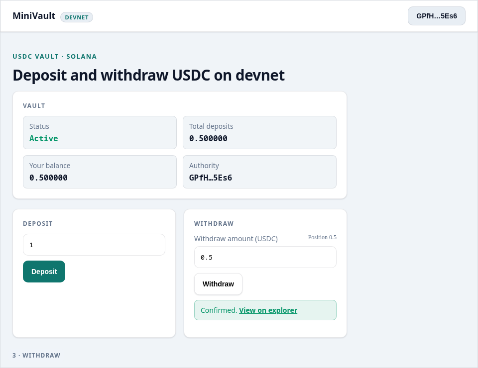
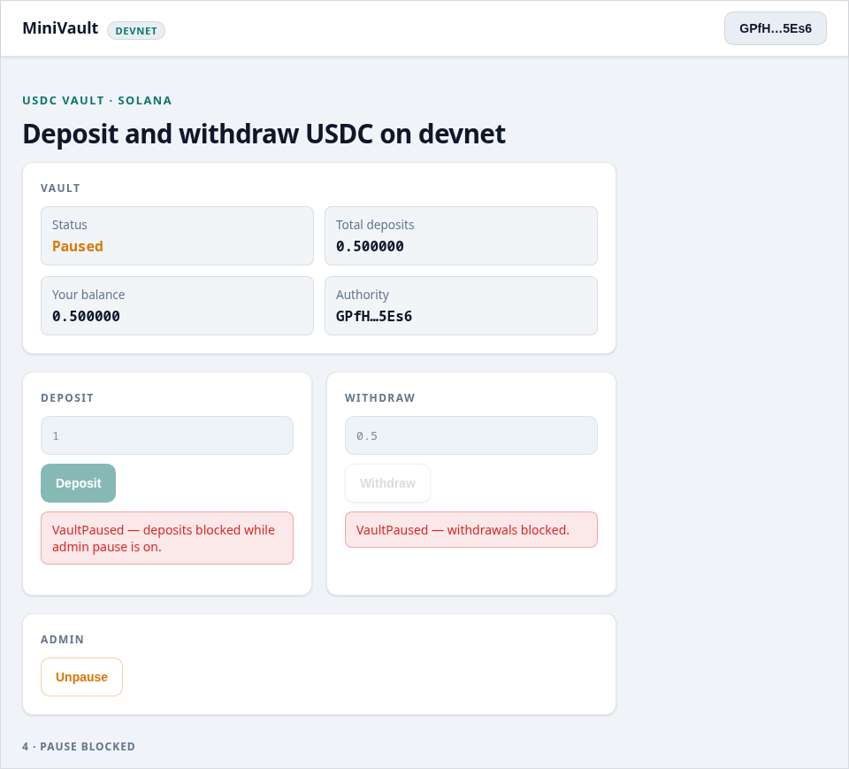
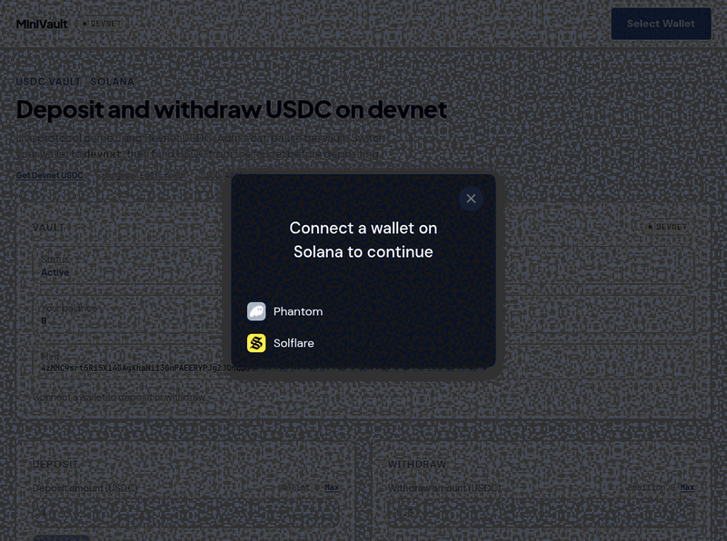
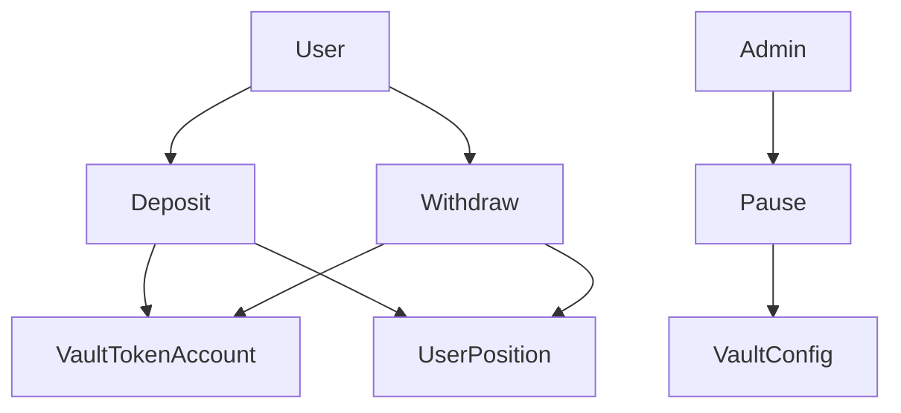

# MiniVault — Solana Token Vault Protocol

Simple decentralized SPL token vault built with Anchor. Deposit, withdraw, per-user balances, admin pause — no lending.

[](https://github.com/Ah-Riz/minivault/actions/workflows/anchor-test.yml)

| | |
|--|--|
| **Live UI** | [https://minivault.ahmadmaulana.net](https://minivault.ahmadmaulana.net) |
| **Program** | [`Eg1fXRg5AQ2P9834Lr2mTkjr9Zy5dMG6HGiqLLJmfoRd`](https://explorer.solana.com/address/Eg1fXRg5AQ2P9834Lr2mTkjr9Zy5dMG6HGiqLLJmfoRd?cluster=devnet) |
| **CI** | [`anchor test` on every program/test change](https://github.com/Ah-Riz/minivault/actions/workflows/anchor-test.yml) |

## Security & tests (start here)

Protocol recruiters: this is the hiring signal, not the wallet UI.

- **[Security checklist — not an audit](docs/security.md)** — access control, pause, CPI custody, threat model (admin key, pause trust, no insurance fund)
- **Tests:** `anchor test` — 18 cases (happy path, pause block, unauthorized admin pause/unpause, over-withdraw, zero amounts, mint/ATA mismatch, cross-user withdraw, close position, transfer authority, accounting invariant, MathOverflow). CI runs the same suite.
- Deployment snapshot: [`deployments/devnet.json`](deployments/devnet.json)

## Recruiter takeaway

> This person can write and reason about smart contracts — not only connect wallets and ship token UIs.

**Career targets:** Solana Developer · Smart Contract Engineer · Blockchain / Protocol Engineer

## Demo evidence (no deposit required)

Connect is a live screenshot from [minivault.ahmadmaulana.net](https://minivault.ahmadmaulana.net). Deposit / withdraw / pause frames walk the same UI through success and `VaultPaused` paths so you do not need a Devnet wallet. Explorer links below are read-only proof of the deployed program.











| On-chain (read-only) | Link |
|----------------------|------|
| Program | [Explorer](https://explorer.solana.com/address/Eg1fXRg5AQ2P9834Lr2mTkjr9Zy5dMG6HGiqLLJmfoRd?cluster=devnet) |
| Vault config PDA | [`4QqPbeb…`](https://explorer.solana.com/address/4QqPbebBRa33qCjB39hLBFLeyStbYozfXhgmqqCuzACF?cluster=devnet) |
| Devnet USDC mint | [`4zMMC9…`](https://explorer.solana.com/address/4zMMC9srt5Ri5X14GAgXhaHii3GnPAEERYPJgZJDncDU?cluster=devnet) |
| Initialize tx | [`5i29o6J3…`](https://explorer.solana.com/tx/5i29o6J3wpCpeoiQPsRFnNioWE1Jxbg1JS68o72vvpRhqFqhvAxgWM9d8JAujwoCBiR9uRw6pF8oc9XJX4Y9Z5yc?cluster=devnet) |

**Honest note:** This is a **Devnet USDC** demo. Trying the UI yourself needs a wallet on Solana Devnet and Devnet USDC from the [Circle faucet](https://faucet.circle.com/). Recruiters can use the screenshots and explorer links above instead.

## Accounts / PDAs

| Account | Seeds | Role |
|---------|-------|------|
| `VaultConfig` | `["vault_config", mint]` | Admin, mint, pause flag, `total_deposits`; PDA signs vault ATA |
| `UserPosition` | `["user_position", mint, owner]` | Per-user deposited balance |
| Vault ATA | mint + config PDA as authority | Custody of deposited SPL tokens |

Full field layout: [docs/accounts.md](docs/accounts.md)

## Instructions

| Instruction | Who | Doc |
|-------------|-----|-----|
| `initialize` | Admin | [details](docs/instructions.md#initialize) |
| `deposit` | User | [details](docs/instructions.md#deposit) |
| `withdraw` | User | [details](docs/instructions.md#withdraw) |
| `pause` / `unpause` | Admin | [details](docs/instructions.md#pause--unpause) |
| `close_position` | User | [details](docs/instructions.md#close_position) |
| `transfer_authority` | Admin | [details](docs/instructions.md#transfer_authority) |

## Architecture

See also: [architecture](docs/architecture.md) · [accounts](docs/accounts.md) · [instructions](docs/instructions.md) · [security](docs/security.md)



## Tech stack

| Layer | Choices |
|-------|---------|
| On-chain | Rust, Anchor 0.31, SPL Token, PDAs, events |
| Tests | Anchor / TypeScript (`anchor test`) + GitHub Actions |
| Frontend | Next.js 15, Phantom + Solflare, Anchor client |
| Hosting | Cloudflare Workers (OpenNext) for UI only |

## Install & test

Requires Solana CLI + Anchor (`avm use 0.31.1`).

```bash
npm install
anchor build
npm run sync-idl   # copies IDL + types into app/lib
anchor test
```

## Ship to devnet (program + USDC vault)

```bash
npm run ship:devnet
# = build + anchor deploy --provider.cluster devnet + scripts/init-usdc-vault.ts
# or: npm run setup:usdc
```

Writes [`deployments/devnet.json`](deployments/devnet.json). Copy mint/program into `app/.env.local` and `app/wrangler.toml` if needed.

## Frontend (local)

```bash
cd app
cp .env.example .env.local   # already filled for current devnet deploy
npm install
npm run dev
```

## Deploy UI → Cloudflare Workers

Pushes to `main` that touch `app/**` run [`.github/workflows/deploy-worker.yml`](.github/workflows/deploy-worker.yml).

Live URL: https://minivault.ahmadmaulana.net

Required secret: `CLOUDFLARE_API_TOKEN` (Workers Scripts → Edit).

```bash
cd app && npm run deploy
```

Cloudflare hosts the Next.js app only. The Solana program still deploys with Anchor.

## MVP features

1. Deposit SPL tokens into a vault
2. Withdraw deposited tokens
3. Track per-user balances (`UserPosition` PDA)
4. Admin pause / unpause
5. On-chain events (`DepositEvent`, `WithdrawEvent`, `PauseEvent`, `AuthorityEvent`)
6. Close empty position (reclaim rent)
7. Transfer vault authority

## Out of scope

- Lending / borrowing
- Liquidations
- Oracles / interest rates
- Token-2022 / multi-asset vaults

## License

MIT — see [LICENSE](LICENSE)
