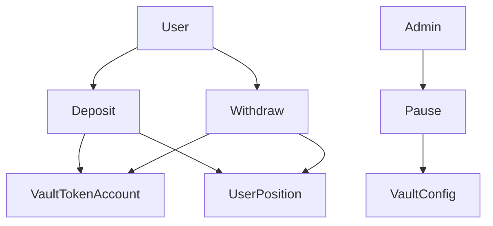

# MiniVault — Solana Token Vault Protocol

Simple decentralized SPL token vault built with Anchor. Deposit, withdraw, per-user balances, admin pause — no lending.

## Live demo (devnet)

| | |
|--|--|
| **App** | [https://minivault.ahmadrizkimaulana666.workers.dev](https://minivault.ahmadrizkimaulana666.workers.dev) |
| **Asset** | Devnet **USDC** |
| **Program** | [`Eg1fXRg5AQ2P9834Lr2mTkjr9Zy5dMG6HGiqLLJmfoRd`](https://explorer.solana.com/address/Eg1fXRg5AQ2P9834Lr2mTkjr9Zy5dMG6HGiqLLJmfoRd?cluster=devnet) |
| **Mint** | [`4zMMC9srt5Ri5X14GAgXhaHii3GnPAEERYPJgZJDncDU`](https://explorer.solana.com/address/4zMMC9srt5Ri5X14GAgXhaHii3GnPAEERYPJgZJDncDU?cluster=devnet) |
| **Vault config** | [`4QqPbebBRa33qCjB39hLBFLeyStbYozfXhgmqqCuzACF`](https://explorer.solana.com/address/4QqPbebBRa33qCjB39hLBFLeyStbYozfXhgmqqCuzACF?cluster=devnet) |
| **Init tx** | [`5i29o6J3…`](https://explorer.solana.com/tx/5i29o6J3wpCpeoiQPsRFnNioWE1Jxbg1JS68o72vvpRhqFqhvAxgWM9d8JAujwoCBiR9uRw6pF8oc9XJX4Y9Z5yc?cluster=devnet) |

Deployment snapshot: [`deployments/devnet.json`](deployments/devnet.json)

### Try it

1. Switch Phantom/Solflare to **Devnet**.
2. Get Devnet USDC from [Circle faucet](https://faucet.circle.com/) (select Solana Devnet).
3. Open the app, connect, deposit → withdraw → (admin) pause / unpause.
4. If you see `Blockhash not found`, set `NEXT_PUBLIC_RPC_URL` to a dedicated Devnet RPC (Helius/QuickNode) — public `api.devnet.solana.com` is often flaky.

## Recruiter takeaway

> This person can write and reason about smart contracts — not only connect wallets and ship token UIs.

**Career targets:** Solana Developer · Smart Contract Engineer · Blockchain / Protocol Engineer

## Architecture

See docs:

- [Architecture](docs/architecture.md) — system diagram, hosting split, instruction flow
- [Account design & PDAs](docs/accounts.md)
- [Instructions](docs/instructions.md)
- [Security considerations](docs/security.md)



## Tech stack

| Layer | Choices |
|-------|---------|
| On-chain | Rust, Anchor 0.31, SPL Token, PDAs, events |
| Tests | Anchor / TypeScript (`anchor test`) |
| Frontend | Next.js 15, Phantom + Solflare, Anchor client |
| Hosting | Cloudflare Workers (OpenNext) for UI only |

## Install & test

Requires Solana CLI + Anchor (`avm use 0.31.1`).

```bash
npm install
anchor build
npm run sync-idl   # copies IDL + types into app/lib
anchor test
```

## Ship to devnet (program + USDC vault)

```bash
npm run ship:devnet
# = build + anchor deploy --provider.cluster devnet + scripts/init-usdc-vault.ts
# or: npm run setup:usdc
```

Writes [`deployments/devnet.json`](deployments/devnet.json) for Devnet USDC. Copy mint/program into `app/.env.local` and `app/wrangler.toml` if needed.

## Frontend (local)

```bash
cd app
cp .env.example .env.local   # already filled for current devnet deploy
npm install
npm run dev
```

## Deploy UI → Cloudflare Workers

### CI (automatic)

Pushes to `main` that touch `app/**` (or the workflow file) run [`.github/workflows/deploy-worker.yml`](.github/workflows/deploy-worker.yml) and deploy the Worker.

Manual run: GitHub → **Actions** → **Deploy Worker** → **Run workflow**.

Required repo secrets:

| Secret | Purpose |
|--------|---------|
| `CLOUDFLARE_API_TOKEN` | API token with **Edit Cloudflare Workers** (create at [dash.cloudflare.com/profile/api-tokens](https://dash.cloudflare.com/profile/api-tokens)) |
| `CLOUDFLARE_ACCOUNT_ID` | `9566706794f5e710b31e54379c39f104` |

Live URL: https://minivault.ahmadrizkimaulana666.workers.dev

### Manual

```bash
cd app
npm run deploy
```

Cloudflare hosts the Next.js app only. The Solana program still deploys with Anchor.

## MVP features

1. Deposit SPL tokens into a vault
2. Withdraw deposited tokens
3. Track per-user balances (`UserPosition` PDA)
4. Admin pause / unpause
5. On-chain events (`DepositEvent`, `WithdrawEvent`, `PauseEvent`, `AuthorityEvent`)
6. Close empty position (reclaim rent)
7. Transfer vault authority

## Out of scope

- Lending / borrowing
- Liquidations
- Oracles / interest rates
- Token-2022 / multi-asset vaults

## License

MIT — see [LICENSE](LICENSE)
