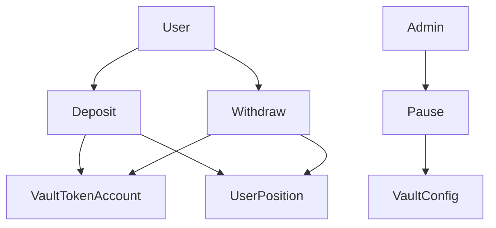

# MiniVault — Solana Token Vault Protocol

Simple decentralized SPL token vault built with Anchor. Deposit, withdraw, per-user balances, admin pause — no lending.

## Live demo (devnet)

| | |
|--|--|
| **App** | [https://minivault.ahmadrizkimaulana666.workers.dev](https://minivault.ahmadrizkimaulana666.workers.dev) |
| **Program** | [`Eg1fXRg5AQ2P9834Lr2mTkjr9Zy5dMG6HGiqLLJmfoRd`](https://explorer.solana.com/address/Eg1fXRg5AQ2P9834Lr2mTkjr9Zy5dMG6HGiqLLJmfoRd?cluster=devnet) |
| **Mint** | [`5vg3tMYz1gYRxCa2VQe3pucqw2hjcTedi4uDWUTH4nMQ`](https://explorer.solana.com/address/5vg3tMYz1gYRxCa2VQe3pucqw2hjcTedi4uDWUTH4nMQ?cluster=devnet) |
| **Vault config** | [`CddTc69KPtiJ9nCB69iMLtUq4kquiNDN5JYq29e7TdJp`](https://explorer.solana.com/address/CddTc69KPtiJ9nCB69iMLtUq4kquiNDN5JYq29e7TdJp?cluster=devnet) |
| **Init tx** | [`tBvC2TQ…`](https://explorer.solana.com/tx/tBvC2TQBujkBg57j1m2XqJ7Uo9HqoYHkh7bzJ6ArwdDtMMx3SCoU3bBdPgSSpHBV8Cpkehd6AGXfvBqS5zUHWH8?cluster=devnet) |

Deployment snapshot: [`deployments/devnet.json`](deployments/devnet.json)

### Try it

1. Switch Phantom/Solflare to **Devnet**.
2. Open the app URL above and connect.
3. To deposit: you need the demo mint in your wallet (authority wallet already holds supply after `setup:devnet`). Transfer some tokens from the authority ATA, or mint more with the mint authority.
4. Deposit → withdraw → (admin) pause / unpause.

## Recruiter takeaway

> This person can write and reason about smart contracts — not only connect wallets and ship token UIs.

**Career targets:** Solana Developer · Smart Contract Engineer · Blockchain / Protocol Engineer

## Architecture

See docs:

- [Architecture](docs/architecture.md) — system diagram, hosting split, instruction flow
- [Account design & PDAs](docs/accounts.md)
- [Instructions](docs/instructions.md)
- [Security considerations](docs/security.md)



## Tech stack

| Layer | Choices |
|-------|---------|
| On-chain | Rust, Anchor 0.31, SPL Token, PDAs, events |
| Tests | Anchor / TypeScript (`anchor test`) |
| Frontend | Next.js 15, Phantom + Solflare, Anchor client |
| Hosting | Cloudflare Workers (OpenNext) for UI only |

## Install & test

Requires Solana CLI + Anchor (`avm use 0.31.1`).

```bash
npm install
anchor build
npm run sync-idl   # copies IDL + types into app/lib
anchor test
```

## Ship to devnet (program + mint + initialize)

```bash
npm run ship:devnet
# = build + anchor deploy --provider.cluster devnet + scripts/devnet-setup.ts
```

Writes [`deployments/devnet.json`](deployments/devnet.json). Then copy program/mint into `app/.env.local` and `app/wrangler.toml`.

## Frontend (local)

```bash
cd app
cp .env.example .env.local   # already filled for current devnet deploy
npm install
npm run dev
```

## Deploy UI → Cloudflare Workers

```bash
cd app
npm run deploy
```

Cloudflare hosts the Next.js app only. The Solana program still deploys with Anchor.

## MVP features

1. Deposit SPL tokens into a vault
2. Withdraw deposited tokens
3. Track per-user balances (`UserPosition` PDA)
4. Admin pause / unpause
5. On-chain events (`DepositEvent`, `WithdrawEvent`, `PauseEvent`)

## Out of scope

- Lending / borrowing
- Liquidations
- Oracles / interest rates
- Token-2022 / multi-asset vaults

## License

MIT — see [LICENSE](LICENSE)
