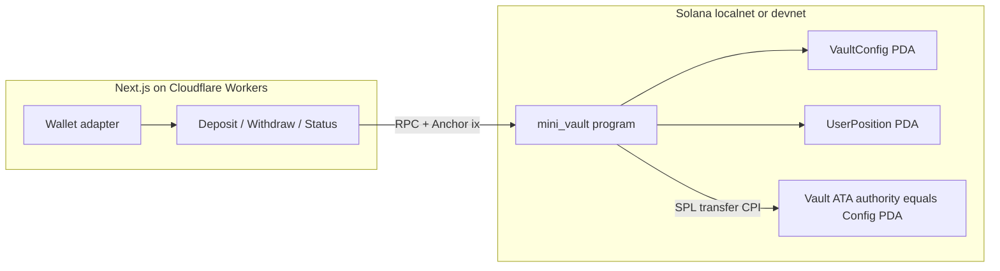

# Architecture

MiniVault is a single-mint SPL custody vault on Solana. Users deposit tokens into a PDA-owned ATA; balances are tracked in per-user `UserPosition` PDAs. An admin authority can pause deposits and withdrawals.

## System diagram



## Hosting split

| Component | Where it runs |
|-----------|----------------|
| Frontend (Next.js) | Cloudflare Workers via OpenNext (`cd app && npm run deploy`) |
| On-chain program | Solana (`anchor deploy` to localnet / devnet / mainnet) |

Cloudflare hosts **only** the UI. It cannot deploy or execute the Solana program.

## Instruction flow

### Initialize (admin)

1. Admin signs `initialize` with a chosen SPL mint.
2. Program creates `VaultConfig` PDA (`["vault_config", mint]`).
3. Program creates the vault ATA with authority = `VaultConfig` PDA.
4. Config stores authority, mint, vault ATA, `paused = false`, `total_deposits = 0`.

### Deposit (user)

1. UI builds `deposit(amount)` with user ATA + vault ATA + position PDA.
2. Program rejects if paused or `amount == 0`.
3. CPI: SPL transfer user → vault (user is signer).
4. Credit `UserPosition.amount` and `VaultConfig.total_deposits` (checked math).

### Withdraw (user)

1. UI builds `withdraw(amount)`.
2. Program rejects if paused, zero amount, or amount > position.
3. Debit position + total, then CPI transfer vault → user signed by `VaultConfig` PDA seeds.

### Pause / unpause (admin)

1. Authority signer must match `VaultConfig.authority`.
2. Flip `paused`; deposit/withdraw read this flag on every call.

## Frontend data path

```
Wallet connect → fetch VaultConfig + UserPosition via RPC
  → deposit / withdraw / pause methods (Anchor)
  → confirm signature → refresh balances → show explorer link
```

Env vars (`NEXT_PUBLIC_RPC_URL`, `NEXT_PUBLIC_PROGRAM_ID`, `NEXT_PUBLIC_MINT`) must match the cluster where the program and mint live.
